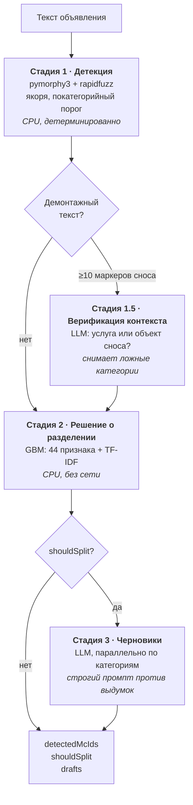

# service-classifier

Определяет по тексту объявления о ремонте, какие услуги мастер готов продавать
отдельно, и генерирует черновики отдельных объявлений под каждую из них.

> **О данных.** Исходный набор кейса — объявления площадки — не подлежит
> распространению, поэтому в репозитории его нет: ни самих объявлений, ни
> обученной на них модели, ни словаря фраз от организаторов. Вместо него здесь
> лежит генератор синтетического датасета в той же схеме, чтобы весь пайплайн
> запускался end-to-end. Все метрики ниже измерены на данных кейса и на
> синтетике не воспроизводятся — подробности в разделе [Данные](#данные).

## Задача

Мастер публикует одно объявление в категории «Ремонт квартир и домов под ключ»
и перечисляет в нём десяток видов работ. По запросу «укладка плитки» такое
объявление в выдаче не появится: категория другая. Мастер теряет заказы,
площадка — релевантную выдачу. Нужно понять, какие услуги названы в тексте, и
решить, продаются ли они как самостоятельные — тогда мастеру стоит предложить
создать под них отдельные объявления.

Сложность не в извлечении сущностей, а в различении двух почти одинаковых
формулировок:

```
«Делаем ремонт под ключ, включая электрику»  →  электрика в тексте есть,
                                                но продаётся ремонт целиком
«Электрику делаем отдельно»                  →  электрика продаётся отдельно
```

Ключевые слова совпадают. Различаются они упаковкой услуги, и провести эту
границу — и есть задача. Причём граница субъективна: на пограничных объявлениях
расходятся и живые разметчики, что задаёт потолок достижимого качества.

Кейс площадки объявлений на IT Purple Hack 2026, первое место.

## Архитектура

Четыре стадии. LLM участвует ровно в двух — там, где выигрывает по замерам.



| Стадия | Метод | Почему так |
|---|---|---|
| 1. Детекция | Лемматизация + fuzzy | Детерминированно, без сети, объяснимо |
| 1.5. Верификация | LLM | Нужно понимание контекста; срабатывает редко |
| 2. Разделение | GBM + TF-IDF | Обходит лучшую LLM на 10 п.п. |
| 3. Черновики | LLM | Генерация текста — её задача |

Стадия 1.5 включается, только если в тексте набралось не меньше десяти маркеров
сноса (`DEMOLITION_VERIFICATION_MIN_MARKERS`), поэтому на пропускную способность
она почти не влияет.

## Метрики

Измерено на данных кейса: 2480 размеченных объявлений, 11 микрокатегорий.

| Что | Метрика | Значение |
|---|---|---|
| Детекция услуг, словарь (стадия 1) | F1 | **0.929** |
| Детекция услуг, обучаемый baseline | F1 | 0.800 |
| Решение о разделении, GBM (стадия 2) | Accuracy, CV 5-fold | **0.848** |
| Решение о разделении, лучшая из семи LLM | Accuracy | 0.747 |
| Черновики, доля с выдуманными фактами | Gemini 2.0 Flash | **1%** |
| Черновики, доля с выдуманными фактами | Qwen3-235B | 36% |

**Почему у стадии 1 нет колонки с кросс-валидацией, а у стадии 2 есть.** Это не
небрежность, а разница в природе стадий. Стадия 1 ни на чём не обучается: это
словарь фраз плюс правила, поэтому прогон по всей размеченной выборке — просто
замер, переобучаться там нечему. Стадия 2 обучается, и train-метрика показывала
бы лишь то, что градиентный бустинг способен запомнить выборку. Единственная
осмысленная цифра для неё — кросс-валидационная, она и приведена.

Train-метрики стадии 2 в этом README сознательно не приводятся: сами по себе они
только вводят в заблуждение, а исходных данных для их перепроверки в репозитории
нет.

### Что печатает `make run` на синтетике

Чтобы было с чем сверить локальный запуск (**к качеству на реальных данных эти
числа отношения не имеют** — см. [Данные](#данные)):

```
Обработано 400 объявлений за 4.5с (89.5 items/sec)

Detection      precision=0.8010  recall=0.9661  f1=0.8758
shouldSplit    accuracy=1.0000 (400/400)
Split          precision=0.8709  recall=0.9582  f1=0.9125
```

Метрики воспроизводятся ровно (генератор засеян), пропускная способность
зависит от машины.

Accuracy 1.000 здесь — свойство генератора, а не модели: архетипы объявлений в
нём разделимы по построению. `make train` печатает про это отдельное
предупреждение.

## Решения и компромиссы

### Почему стадия 1 — ключевые слова, а не LLM

Отдать распознавание услуг модели было соблазнительно, но замер этого не
поддержал: словарная детекция дала F1 0.929, обученный на тех же данных
TF-IDF + OneVsRest — 0.800. Объединения двух подходов (union, intersect,
fallback при пустом словарном ответе) не выиграли ни в одном варианте
(`training/experiments/tfidf_detection_baseline.py`).

Даже при равном качестве словарь предпочтительнее по трём причинам, и ни одна
из них не про точность:

- **Детерминированность.** Один и тот же текст всегда даёт один и тот же ответ.
  Ошибку можно воспроизвести, найти виноватую фразу и починить словарь — так всё
  и происходило: каждое значение в `PER_CATEGORY_MIN_MATCHES` и каждое якорное
  слово выросли из разбора конкретных ложных срабатываний. У 103 «Электрика»
  при пороге в одно совпадение было 242 ложных срабатывания, у 102 «Сантехника» —
  152, у 110 «Гипсокартон» — 136.
- **Скорость и цена.** Детекция идёт на CPU: 12 мс на объявление с прогретым
  кешем лемм, порядка 80 объявлений в секунду в один поток. Запрос к LLM — это
  секунды и деньги за токены. При потоке в миллионы объявлений разница между
  batch-джобом и статьёй расходов.
- **Отсутствие выдумок.** Модель физически не может «найти» услугу, которой нет
  в тексте: фраза либо есть в словаре и в объявлении, либо нет.

Ответ детектора объясним без дополнительной работы: `/process?details=true`
возвращает список фраз, из-за которых сработала каждая категория.

Единый порог совпадений для всех категорий работал хуже покатегорийного, и
показательно — в обе стороны. Категории вроде электрики и сантехники набирали
сотни ложных срабатываний при пороге в одно совпадение, а вот 104 «Натяжные
потолки» на пороге в два совпадения теряла recall с 0.833 до 0.613. У 111
«Демонтажные работы» порог в одно совпадение ронял F1 до 0.543. Поэтому порог
задан на категорию, а однозначные слова-якоря его обходят.

### Почему лемматизация и fuzzy, а не эмбеддинги

Эмбеддинги решают задачу семантической близости. Здесь нужна другая —
морфологическая нормализация и устойчивость к опечаткам. «Электрику»,
«электрике», «электрикой» — это не близкие смыслы, а одно и то же слово, и
pymorphy3 сводит их к лемме точно, а не приблизительно.

Главное же в том, что семантическая близость здесь прямо вредна: «демонтаж
плитки» и «укладка плитки» в векторном пространстве — почти соседи, а для этой
задачи они противоположности. Одно означает, что мастер сносит чужую работу,
другое — что он делает свою. Модель, оптимизированная сближать такие фразы,
работает против условия задачи, а не на него.

Плюс эмбеддинги дали бы худший инженерный компромисс: сотни мегабайт весов и
десятки миллисекунд на текст против доли миллисекунды, порог косинусной близости
вместо явного списка фраз и невозможность показать, почему сработала категория.

Два уточнения, найденные разбором ошибок:

- **Порог fuzzy подняли с 80 до 86.** На 80 многословные фразы совпадали по
  общему префиксу — «демонтаж старой ...» матчился со всем подряд, — что давало
  476 ложных срабатываний. Однословные фразы оказались ещё опаснее, для них
  порог отдельный и выше.
- **В 16% текстов часть кириллицы заменена на визуально идентичную латиницу**
  (`о` → `o`, `е` → `e`). Без нормализации гомоглифов такие объявления теряются
  целиком, и никакая модель поверх этого не спасёт: это предобработка, а не
  распознавание.

### Почему стадию 2 выиграл GBM у семи LLM

Самый содержательный результат проекта. Проверялось последовательно:

| Что пробовали | Accuracy |
|---|---|
| Семь LLM с одним промптом, лучшая | 0.747 |
| Пять вариантов промпта, худший (контрастный few-shot) | 0.584 |
| GBM + LLM на пограничных случаях | хуже чистой GBM |
| **GBM: 44 ручных признака + TF-IDF** | **0.848** |

Причина не в том, что модели слабые. Граница «специалист или подрядчик» задаётся
не логикой, которую можно изложить в инструкции, а распределением решений
конкретных разметчиков. GBM учит это распределение. LLM пытается его вывести — и
стабильно выводит свою собственную, вполне разумную, но другую логику.

Диагностическая деталь: худшим оказался контрастный few-shot вариант промпта
(0.584) — тот самый, где правило сформулировано резче всего и подкреплено
примерами. Чем чётче объясняешь модели границу, тем увереннее она уходит от
границы разметчика. Это верный признак того, что проблема не в формулировке, и
дальше шлифовать промпт бессмысленно.

Гибрид отвергнут по замеру, а не по вкусу: LLM, вызванная только там, где GBM не
уверена, исправила 66 решений и испортила 88
(`training/experiments/hybrid_gbm_llm.py`). Отрицательный результат, но
измеренный, — поэтому в проде осталась чистая GBM.

**Вывод, который переносится на другие задачи.** Не стоит ставить LLM туда, где
целевая переменная определяется соглашением разметчиков, а не смыслом текста:
модель прекрасно воспроизводит смысл и плохо — соглашение. Побочный выигрыш
здесь заметный: стадия 2 считается за десятые доли миллисекунды на CPU и не
зависит от доступности внешнего API.

### Почему черновики генерирует Gemini, а не Qwen

Единственная стадия, где LLM незаменима, — и выбор модели здесь тоже решался
замером. На одной и той же выборке Qwen3-235B добавлял факты, которых нет в
оригинале, в **36%** черновиков, Gemini 2.0 Flash — в **1%**.

Выглядела выдумка так: в оригинале «натяжные потолки», в черновике —
«многоуровневые, теневые, парящие, с подсветкой». Формально текст стал лучше;
фактически это обещание от имени мастера, которого он не давал. Для площадки
объявлений это не стилистическая придирка, а неверные данные в карточке услуги.

Неприятная часть находки: качество текста и правдивость оказались не связаны.
Более «богатые» черновики Qwen были и более лживыми, так что выбирать по
читаемости значило выбирать худшее. Поэтому критерием стала доля добавленных
фактов — величина, которую можно посчитать, а не оценить на глаз
(`training/experiments/draft_hallucination_audit.py` ищет в черновике маркеры
фактов, отсутствующих в оригинале). Промпт стадии 3 содержит явные отрицательные
примеры — именно они, а не общие запреты вида «не выдумывай», и дали 1%.

### Откуда берётся разрыв train/CV и что делать дальше

У стадии 2 train-метрики заметно выше кросс-валидационных, и разрыв
раскладывается на три части — из которых модельная только одна.

**Переобучение.** Признаков много относительно числа примеров: 44 ручных плюс
TF-IDF, и словарь TF-IDF растёт с корпусом (на синтетическом наборе из 400
объявлений это 761 признак, что уже видно в выводе `make train`). Лечится
сокращением словаря и регуляризацией — единственная часть разрыва, которую
закрывают инженерно.

**Метрика.** Split F1 считается по парам «объявление × категория», а ошибается
модель на уровне объявления целиком: одно неверное бинарное решение обнуляет
сразу все пары этого объявления. Метрика штрафует не там, где принимается
решение, и потому просаживается сильнее, чем accuracy.

**Субъективность разметки.** На пограничных объявлениях расходятся живые
разметчики; эксперт площадки подтвердил, что часть случаев допускает обе
трактовки. Модель не может воспроизвести решения, которые не воспроизводит и
человек, — эта часть разрыва не лечится ничем.

Что стоило бы сделать с большим запасом времени:

- **Измерить потолок.** Разметить 200 пограничных объявлений двумя-тремя людьми
  независимо и посчитать их согласие. Без этой цифры непонятно, борется модель с
  шумом или с собственной слабостью, — а от ответа зависит, куда вкладываться.
- **Заменить бинарное решение калиброванной вероятностью.** Продуктово мастеру
  показывают предложение, а не приговор: порог можно двигать под допустимую долю
  ложных предложений, а на неуверенных случаях не предлагать ничего.
- **Сузить TF-IDF.** Отбор по важности или урезание словаря должны сократить
  именно ту часть разрыва, которая от переобучения.
- **Разметка на уровне фрагментов.** Пробовали и отказались: объявления с
  `shouldSplit=true` и `false` структурно неразличимы, разделяет их не форма
  текста, а намерение автора. Это требует другой разметки, а не другой модели.

### Что ещё пробовали и отвергли

| Подход | Результат | Почему отвергнут |
|---|---|---|
| TF-IDF-классификатор для детекции | F1 0.800 | Слабее словаря (0.929) |
| Union и intersect словаря с TF-IDF | Не лучше словаря | Усложнение без выигрыша |
| Единый `min_matches` для всех категорий | Хуже покатегорийного | 104 теряла recall, 103 набирала FP |
| GBM + LLM на пограничных случаях | Исправила 66, испортила 88 | Чистая GBM лучше |
| Контрастный few-shot для стадии 2 | 0.584 | Худший из вариантов промпта |
| Сегментация по фрагментам | Не реализовано | Классы структурно неразличимы |

## Данные

**Исходный набор кейса не распространяется** — это данные площадки. Вместе с ним
из репозитория убраны обученная на нём модель и словарь ключевых фраз, который
поставляли организаторы.

Взамен в репозитории есть:

- **`data/key_phrases.csv`** — словарь ключевых фраз, собранный заново под те же
  11 микрокатегорий (177 фраз).
- **`data/synthetic.py`** — генератор датасета в схеме кейса
  (`itemId;sourceMcId;sourceMcTitle;description;targetDetectedMcIds;targetSplitMcIds;shouldSplit;caseType;split`).
  Объявления собираются из фрагментов реальных формулировок по четырём
  архетипам — специалист, комплексный ремонт, чистый демонтаж, одна услуга — с
  опечатками, гомоглифами и эмодзи. Разметка известна по построению, генерация
  засеяна и воспроизводима.

Синтетика существует ровно для одного: чтобы пайплайн, обучение и метрики
запускались end-to-end у любого, кто склонировал репозиторий. **Цифры из раздела
«Метрики» на ней не воспроизводятся и не должны** — архетипы там разделимы по
построению, и `make train` честно печатает про это предупреждение, выдавая
accuracy около единицы. Единственные настоящие метрики в этом README — измеренные
на данных кейса.

## Запуск

```bash
make install          # зависимости и dev-инструменты
make data             # синтетический датасет (400 объявлений)
make train            # классификатор стадии 2
make run              # прогон пайплайна с метриками
```

Всё перечисленное работает без сети и без API-ключей.

### Режим без LLM

Если `OPENROUTER_API_KEY` не задан, сервис поднимается в offline-режиме и
сообщает об этом в логе и в `/health`:

- стадии 1 (детекция) и 2 (решение о разделении) работают полностью;
- стадия 1.5 ничего не отбрасывает — то же поведение, что и при ошибке API:
  потерять recall хуже, чем оставить лишнюю категорию, которую отфильтрует
  стадия 2;
- стадия 3 отдаёт шаблонный текст с флагом `fallback: true`. Заглушка намеренно
  бедная: очевидно шаблонный черновик лучше правдоподобного с выдуманными
  фактами.

Стадия 2 выбирает режим сама: обученный классификатор → LLM → эвристика по
признакам. Выбранный режим виден в `/health` как `splitMode`, так что
деградация никогда не бывает молчаливой.

### HTTP-сервер

```bash
make api                        # http://localhost:8000
docker compose up --build -d    # то же в контейнере
```

На `/` — веб-интерфейс для ручной проверки, на `/docs` — OpenAPI.

```bash
curl -X POST http://localhost:8000/process \
  -H 'Content-Type: application/json' \
  -d '{"itemId": 1, "mcId": 101, "mcTitle": "Ремонт квартир",
       "description": "Штукатурка стен по маякам, монтаж гипсокартона, электромонтаж. Каждый вид работ считаю отдельно, цена от 900 руб."}'
```

```json
{
  "detectedMcIds": [103, 108, 110],
  "shouldSplit": true,
  "drafts": [
    {
      "mcId": 108,
      "mcTitle": "Штукатурные работы",
      "text": "Выполняю штукатурные работы — выравнивание стен по маякам...",
      "fallback": false
    }
  ]
}
```

| Эндпоинт | Назначение |
|---|---|
| `POST /process` | Полный проход; `?details=true` добавляет сработавшие фразы |
| `POST /batch` | Пакетная обработка |
| `POST /detect` | Только стадия 1 — без сети |
| `GET /health` | Режим стадии 2, состояние LLM, число категорий |

### Проверки

```bash
make lint       # ruff
make typecheck  # mypy --strict
make test       # pytest
```

## Структура

```
service_classifier/      Пайплайн
  detection.py             Стадия 1: лемматизация, fuzzy, якоря
  verification.py          Стадия 1.5: LLM-верификация демонтажного контекста
  split.py                 Стадия 2: 44 признака и классификатор
  drafts.py                Стадия 3: генерация черновиков
  pipeline.py              Оркестрация стадий и пакетная обработка
  llm.py                   Клиент OpenRouter с повторами
  datasets.py              Чтение и запись датасета в схеме кейса
  evaluation.py            Micro-F1, accuracy, покатегорийная разбивка
  config.py                Микрокатегории, пути, настройки окружения
  cli.py                   python -m service_classifier
api/
  server.py                FastAPI: /process, /batch, /detect, /health
  static/index.html        Веб-интерфейс
data/
  key_phrases.csv          Словарь ключевых фраз, 11 микрокатегорий
  synthetic.py             Генератор датасета
training/
  train_split_classifier.py    Обучение стадии 2: CV, выбор модели, порог
  tune_fuzzy_threshold.py      Подбор порога fuzzy и длины фразы
  tune_min_matches.py          Подбор покатегорийных порогов
  experiments/                 Проверки, определившие архитектуру (см. README)
tests/                     pytest, без обращений к сети
```

## Лицензия

MIT.
